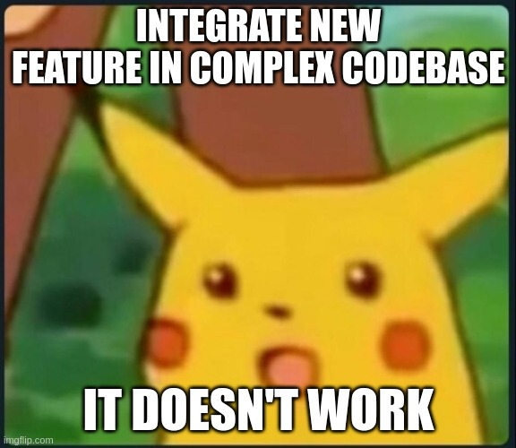

:::div{style='display: none;'}
:define-var[Context considered harmful]{#title}
:define-var[how hooks aren't state management]{#subtitle}
:define-var[]{#section}
:::

::::::::::::::::::shell

<header>

::::div{style = "display: flex; width: 100%; justify-content: space-between"}
::var{#title}
::var{#section}
::::

</header>

<footer>


<div class="speaker">
  
  <span>@KatjaPotensky</span>
</div>

</footer>

::::::::::::::::::::::::

:::slide{#greeting.no-shell}

# :var{#title}

### :var{#subtitle}

<!-- this is optional but useful for external events -->
<div class="info">
  
  <div class="speaker">
    
    <h4>@KatjaPotensky</h4>
  </div>
</div>


:::

[//]: <> (PRESENTATION STARTS HERE)
[//]: <> (PRESENTATION STARTS HERE)
[//]: <> (PRESENTATION STARTS HERE)

::::slide{#agenda}

<div class="center">

# Agenda

1. Refresher
1. Intro
1. Journey into the unknown

</div>

::::

:::::::::::::::::::::::::::::::::::slide

::::slide{.no-shell.bg-black}

<div class="center">

# Refreshing the basics

</div>

::::

::::slide

# Hooks

```typescript
const Component = function Component() {
  // simply associate value to component
  const ref = React.useRef("A simple value");
  // current state and function to update it
  const [seed, setSeed] = React.useState(42);
  // derived value
  const answerToLife = React.useMemo(() => calculate(seed), [seed]);
  // infinite loop
  setSeed((current) => current + 1);
};
```

::::

::::slide

# Context

```tsx
<Provider value={"Hey mom"}>
  <Nested>
    <Component>
      <Consumer>
        {/* 
          const value = useContext() // Hey mom 
         */}
      </Consumer>
    </Component>
  </Nested>
</Provider>
```

:::speaker

- dependency injection

:::

::::

::::slide

# Reducers

```typescript
const reducer = (count, action) =>
  match(action)
    .with({ type: "increment" }, () => count + 1)
    .with({ type: "decrement" }, () => count - 1)
    .with({ type: "multiply" }, ({ by }) => count * by)
    .otherwise(() => count);

const state1 = reducer(21, { type: "decrement" }); // 20
const state2 = reducer(state1, { type: "increment" }); // 21
const state3 = reducer(state2, { type: "multiply", by: 2 }); // 42
```

:::speaker

- associate the "what" with the "how" in a pure way
- ideal for business logic

:::

::::

:::::::::::::::::::::::::::::::::::

:::::::::::::::::::::::::::::::::::slide

::::slide{.no-shell.bg-black}

<div class="center">

# Intro

</div>

:::speaker

- intro to application code

# Reasons to refactor

- mixed concerns
- hard to read

:::

::::

:::::::::::::::::::::::::::::::::::

[//]: <> (START: Orthogonal Responsibilities)

:::::::::::::::::::::::::::::::::::slide

::::slide{.bg-black}

<div class="center text-center">

# Factoring out orthogonal responsibilities

git tag: `start-task-01`

</div>

::::

::::slide{.bg-black}

<div class="center">

# DataSet

- move everything concerning the dataset dropdown to a new component `DataSet` in the dataset module
  - don't forget to rename the file if you want to use jsx
  - also transfer `useData`
- add all necessary imports
  - `pipe` should come from `fp-ts/lib/function`
- don't worry about dependent state and compile time errors yet

</div>

::::

::::slide{.bg-black}

<div class="center">

# FilterArea

- move everything concerning the filter area to a new component `FilterArea` in the filter module
  - don't forget to rename the file if you want to use jsx
  - also transfer `useData`
- add all necessary imports
  - `pipe` should come from `fp-ts/lib/function`
- don't worry about dependent state and compile time errors yet

</div>

::::

::::slide{.bg-black}

<div class="center">

# EpcFilter

- move everything concerning the actual energy per capita filter from `FilterArea` to a new component `EpcFilter`

</div>

::::

::::slide{.no-shell}

<div class="center">

# Wrap-Up

- we've split the app into dedicated components
- app is currently broken
- we have to find a way to manage state across components now

</div>

::::

:::::::::::::::::::::::::::::::::::

[//]: <> (END: Orthogonal Responsibilities)
[//]: <> (START: Fixing the state)

:::::::::::::::::::::::::::::::::::slide

::::slide{.no-shell.bg-black}

<div class="center">

# Fixing the state

</div>

:::speaker

- use context to share state across multiple components

:::

::::

::::slide{.bg-black}

<div class="center">

# The reducer

- create `state.tsx`
- define `type State` (+ `initialState`) which holds
  - current data (initially empty)
  - maybe a dataset (initially `option.none`)
  - record of filters by id (initially empty)
- define actions
  - `SetData`: sets the current data
  - `SetDataSet`: sets the selected dataset
  - `SetFilter`: changes a single filter
- write the reducer (tip: use `ts-pattern/match`)

</div>

::::

::::slide{.bg-black}

<div class="center">

# Creating some context

- create a context that holds the current `state` and `dispatch` function
  ```typescript
  const context = React.createContext<[State, React.Dispatch<Action>]>([
    initialState,
    () => {
      /* ignore */
    },
  ]);
  ```

</div>

::::

::::slide{.bg-black}

<div class="center">

# Providing the context

- create a `StateProvider` to provide the `state` and `dispatch` function
  ```tsx
  export const Provider = function StateProvider({
    children,
  }: React.PropsWithChildren) {
    const value = React.useReducer(reducer, initialState);
    return <context.Provider value={value}>{children}</context.Provider>;
  };
  ```
- create a `useState` hook
- create a `useDispatch`
- wrap the whole `App` in `StateProvider` (in `index.tsx`)

</div>

::::

::::slide{.bg-black}

<div class="center">

# The current dataset

<ul>
  <li>

write a selector that returns the rows within the current dataset

```typescript
const selectDatasetRows = ({ dataset, data }: State): Row[] =>
  pipe(
    dataset,
    option.map((dataset) => data.filter(dataset.predicate)),
    option.getOrElse(() => data)
  );
```

  </li>
</ul>

</div>

::::

::::slide{.bg-black}

<div class="center">

# Filtered rows

<ul>
  <li>

write a selector that returns the filtersed rows based on the dataset

```typescript
const selectFilteredRows = (state: State) => {
  const dataSetRows = selectDatasetRows(state);
  const filters = Object.values(state.filters);
  return dataSetRows.filter((row) =>
    filters.every((filter) => filter.predicate(row))
  );
};
```

  </li>
  <li class="fragment">

write a hook that returns the filtered rows

```typescript
export const useFilteredRows = flow(useState, selectFilteredRows);
```

  </li>
</ul>

</div>

::::

::::slide{.bg-black}

<div class="center">

# Using the state

### App

- `useFilteredRows` to get the rows for the table

</div>

::::

::::slide{.bg-black}

<div class="center">

# Updating data

- create `useSetData` in `state.tsx`
  ```typescript
  export const useSetData = () => {
    const dispatch = useDispatch();
    return (data: Row[]) => 
      dispatch({ type: "set data", payload: data });
  };
  ```
- use the hook in `App`

  ```typescript
  const setData = useSetData();

  const data = useData();
  React.useEffect(() => setData(data), [data]);
  ```

</div>

::::

::::slide{.bg-black}

<div class="center">

# Updating the dataset

- create `useSetDataset` in `state.tsx`
- use the hook in `DataSet`
  ```typescript
  const setStoreDataset = useSetDataset();
  React.useEffect(() => {
    setStoreDataset(dataset);
  }, [dataset]);
  ```

</div>

::::

::::slide{.bg-black}

<div class="center">

# Updating filters

- create `useSetFilter` in `state.tsx`
- use the hook in `EpcFilter`

  ```typescript
  const setFilter = useSetFilter();
  React.useEffect(() => {
    setFilter(epcFilter);
  }, [epcFilter]);
  ```

</div>

::::

::::slide{.no-shell}

<div class="center">

# Wrap-Up

- we've cleaned up the app
- shared state is in context
- everything works fine, albeit a bit slow

</div>

::::

:::::::::::::::::::::::::::::::::::

[//]: <> (START: Where the problems start)

:::::::::::::::::::::::::::::::::::slide

::::slide{.bg-black.no-shell}

<div class="center">

# Where the problems start

git tag: `start-task-02`

</div>

::::

::::slide{.bg-black}

<div class="center">

# Count active filters

- create `selectFilters` in `state.tsx`
  - should just return the current filters
  - wrap it in hook again `useFilters`
- display the size of the filters in `FilterArea`
- simulate slow `FilterArea` UI by calculating `fib(40)` on every render
  ```typescript
  const fib = (x: number): number => {
    return x === 0 ? 0 : x === 1 ? 1 : fib(x - 1) + fib(x - 2);
  };
  ```
- change the dataset

</div>

::::

::::slide

<div class="center">

# It's slow...

### but why?

###### Nothing changes in the FilterArea?

</div>

:::speaker

- show react profiler
- filter area renders twice

:::

::::

::::slide{.bg-black}

<div class="center">

# Trying to fix it

- wrap `FilterArea` in `React.memo`

</div>

::::

::::slide{.no-shell}

<div class="center">

# Wrap-Up

- consumers rerender, regardless of relevance
- since we're using context `React.memo` has no effect

<h3 class="fragment">What now?</h3>

</div>

::::

:::::::::::::::::::::::::::::::::::

[//]: <> (END: Where the problems start)

[//]: <> (START: Splitting contexts)

:::::::::::::::::::::::::::::::::::slide

::::slide{.bg-black.no-shell}

<div class="center">

# Splitting contexts

git tag: `start-task-03`

</div>

:::speaker

- if we can factor out the irrelevant context that should fix the problem

:::

::::

::::slide{.bg-black}

<div class="center">

# Slice'n'dice

- split the state into
  - data
  - filters
  - dataset
- give each their own provider
- local state is enough for now
- delete `state.tsx`

</div>

::::

::::slide{.bg-black}

<div class="center">

# Data

- rename `data.ts` to `data.tsx`
- rename `data.tsx/useData` to `useRemoteData` (don't refactor, just rename)
- create a react context that holds data and the update function
  ```typescript
  const context = React.createContext<
    [Row[], React.Dispatch<React.SetStateAction<Row[]>>]
  >([
    [],
    () => {
      /*ignore*/
    },
  ]);
  ```
- create a `DataProvider` with local state
- create two hooks `useData` and `useSetData`
- change `app.tsx` to `useRemoteData`

</div>

::::

::::slide{.bg-black}

<div class="center">

# Dataset

- open `dataset.tsx`
- create a context again that holds the current dataset and an update function
- create a `DataSetProvider` with local state
- create two hooks `useDataset` and `useSetDataset`
- create a hook `useDatasetRows`

  ```typescript
  export const useDatasetRows = () => {
    const data = useData();
    const dataset = useDataset();

    return pipe(
      dataset,
      option.map((dataset) => data.filter(dataset.predicate)),
      option.getOrElse(() => data)
    );
  };
  ```

</div>

::::

::::slide{.bg-black}

<div class="center">

# Filters

- open `filter.tsx`
- create a context again that holds the current filters and an update function
- create a `FiltersProvider` with local state
- create two hooks `useFilters` and `useSetFilter`
  - `useSetFilter` only updates one filter
- create `useFilteredRows`
  ```typescript
  export const useFilteredRows = () => {
    const datasetRows = useDatasetRows();
    const filters = Object.values(useFilters());
    return datasetRows.filter((row) =>
      filters.every((filter) => filter.predicate(row))
    );
  };
  ```

</div>

::::

::::slide{.bg-black}

<div class="center">

# Fixing the errors

- remove all imports from `state.tsx` across the app
  - don't remove the hook usages though
- import the hooks from their new locations
- wrap the `App` in the new Providers instead of the `StateProvider`
  ```tsx
  <DataProvider>
    <DataSetProvider>
      <FiltersProvider>
        <App />
      </FiltersProvider>
    </DataSetProvider>
  </DataProvider>
  ```

</div>

::::

::::slide{.no-shell}

<div class="center">

# Wrap-Up

- we've fixed the performance issue
- by introducing massive complexity

</div>

::::

:::::::::::::::::::::::::::::::::::

[//]: <> (END: Splitting contexts)

[//]: <> (START: Hitting a wall)

:::::::::::::::::::::::::::::::::::slide

::::slide{.no-shell.bg-black}

<div class="center">

# Hitting a wall

git tag: `start-task-04`

</div>

::::

::::slide{.bg-black}

<div class="center">

# A new feature

- hide datasets that are empty based on the filters

</div>

::::

::::slide{.bg-black}

<div class="center">

# Eligible datasets

- change the dataset context to hold
  ```typescript
  type Context = {
    dataset: [
      option.Option<Filter>,
      React.Dispatch<React.SetStateAction<option.Option<Filter>>>
    ];
    eligibleDatasets: Filter[];
  };
  ```
- calculate eligible datasets in `DataSetProvider`
  - based on `useFilteredRows`
- create a new hook `useEligibleDatasets`
- only display the eligible datasets

</div>

::::

::::slide

<div class="center">



</div>

::::

::::slide

<div class="center">


</div>

::::

::::slide{.no-shell}

<div class="center">

# Wrap-Up

#### splitting contexts leads to:

- added complexity
- risk of circular dependencies
- solving it grows ever more complex

</div>

::::

:::::::::::::::::::::::::::::::::::

[//]: <> (END: Hitting a wall)

[//]: <> (START: Going back)
:::::::::::::::::::::::::::::::::::slide

::::slide{.no-shell.bg-black}

<div class="center">

# Time to rethink

git tag: `start-task-05`

</div>

:::speaker

- what do we actually want?
  - good performance
  - no god components

:::

::::

::::slide{.bg-black}

<div class="center">

# Observable state

- install `rxjs`
- create `store` in `StateProvider`
  ```typescript
  const store = React.useMemo(
    () => new BehaviorSubject(initialState), 
    []
  );
  ```
- create `dispatch` in `StateProvider`
  ```typescript
  const dispatch = React.useCallback(
    (action: Action) => {
      const next = reducer(store.value, action);
      store.next(next);
    },
    [store]
  );
  ```
- change the context to `[BehaviorSubject<State>, React.Dispatch<Action>]`

</div>

::::

::::slide{.bg-black}

<div class="center">

# Observing state

- write a `useSelector` hook

  ```typescript
  function useSelector<T>(selector: (state: State) => T) {
    const state = useState();
    const [selected, setSelected] = React.useState(
      () => selector(state.value)
    );

    React.useEffect(() => {
      const subscription = state
        .pipe(map(selector), distinctUntilChanged())
        .subscribe((selected) => setSelected(selected));
      return () => subscription.unsubscribe();
    }, []);

    return selected;
  }
  ```

</div>

::::

::::slide

<div class="center">


</div>

::::

:::::::::::::::::::::::::::::::::::
[//]: <> (END: Going back)

[//]: <> (PRESENTATION ENDS HERE)
[//]: <> (PRESENTATION ENDS HERE)
[//]: <> (PRESENTATION ENDS HERE)

:::slide{#qna.no-shell}


<h1>Questions & possibly Answers</h1>

:::
